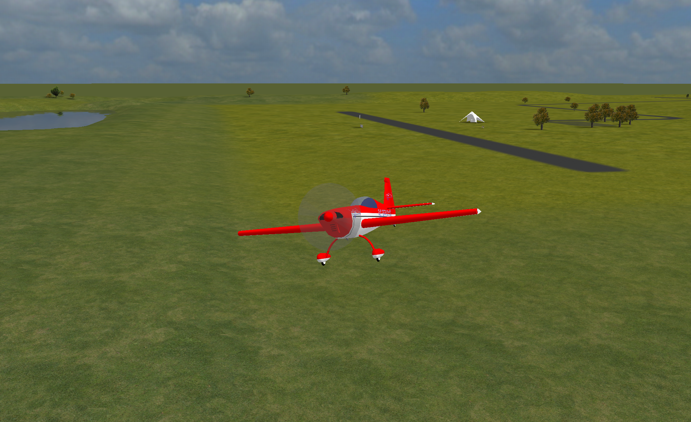
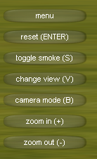
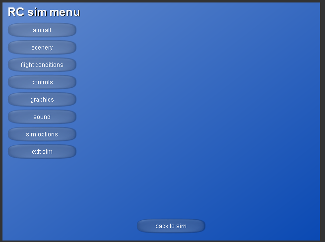
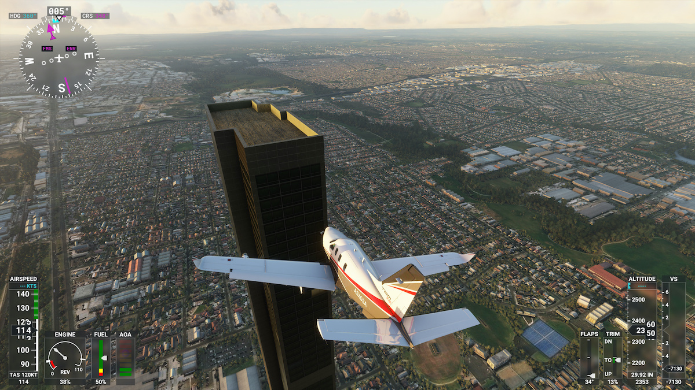

## Analysis
---
### Overview
---
#### A market gap for a model flight sim

The available flight sims currently on the market are designed with full scale aircraft in mind, making them unsuitable for people wishing to increase their flight hours on model aircraft.

All currently available model flight sims are either designed for Windows XP or require proprietary hardware.

A modern flight sim designed on a base of OpenGL 4.0 will provide full performance on modern hardware and sufficient resolution for flying a model aircraft.

To fill this market gap, the sim will need to have sufficient game textures available to approach the detail of a modern sim and sufficiently accurate physics to act as practice for flying read model aircraft.

##### Extracted points

- RC-PC will be a model aircraft flight simulation.
- It is intended as both a game and a realistic simulator.
- To fit as a game, it may be beneficial to add some form of competition
- It should be capable of allowing a user to create their own aircraft.
- This process should be possible using only knowledge of Blender.
- It will be built in C/C++ using OpenGL

##### Points to research
- OpenGL options in C/C++
- Physics of flight

---
#### Stakeholders

My stakeholders will include:
- People interested in simulators as games (a similar demographic to Microsoft Flight Sim)
	- A simulator with a range of features beyond an accurate physics engine
	- A lighter flight sim or one with options which allow the application to run without requiring cutting edge hardware would be preferable for this market to allow a wider demographic
	- A mostly seamless experience without needing to fiddle with settings for setup
	- A range of pre-made aircraft, preventing the need to understand how to define their own
	- A multiplayer aspect would be preferable to fit this demographic, though adds significant complexity with the need for a fast server along with a domain
- People interested in realistic simulation for flight practice
	- Mainly focused on the accuracy and realism of the simulator
	- Completely robust through all orientations and movements
	- Tools to represent their own aircraft in the sim

As such, I will get a number of people within these groups to test the application during testing and once complete to gain an understanding of the success and areas for improvement.

##### Stakeholder requirements
- A flight sim to satisfy the requirements of a practice sim and an enjoyment sim
- Interactive process
	- Create or load aircraft
	- Load aircraft into a map
	- Connect a controller or other input device
	- Fly the aircraft within the map
	- Exit to a menu to load another aircraft or map, or receive input from a different device, or configure the sim or input device
- This interface will require not only a 2D menu renderer and interface, but also a 3D renderer and paired interface
- It should be possible to use as wide a range of input devices as possible, allowing for not only the use of dedicated flight control hardware, but also mouse and keyboard prevents limiting the number of users

##### Usage
- Inputs and outputs from each of the parts of the application:
	- Flight
		- The flight part of the application will require the 3D model of the aircraft, the pre-calculated physics of the model and a map model
		- This will need to output an image of the 3D world to the user from a toggleable mode camera to allow customisation
	- 2D Menus
		- Graphics settings
		- Input bindings and control regimes 
		- Aircraft selection
		- Exit, resume and aircraft editor buttons
		- Weather options
	- Aircraft editor
		- Loading .obj: either drag into the window, or load through a file explorer
		- Enter values for the animations and bones for debugging
		- Option to edit the physics values directly; some of these, such as thrust, will need to be edited manually regardless

##### Meeting stakeholder requirements
- As a game:
Modern graphics with the performance to run on most systems
Variety of built in quality models; remove the need to spend too much time to get the best experience from a casual perspective
Stable: stakeholders looking to play as a game will want the application to be stable and not require any modification to make it run on their system. This is best achieved with a standard framework, as this will have industry tools that will allow the application to be run on a multitude of architectures

- As a flight simulator:
Simulator quality flight physics to allow use of the simulator as a substitute for real practice
Variety of specialist input devices to allow the use of the most suitable, or currently owned by the stakeholder, one for the best experience for the user
Ability to make their own aircraft models; this will allow more experienced and enthused users to import a model of any aircraft they may have built and be able to fly it in the sim

I also plan to ask some people outside of this target market to gauge usability and to possible add some form of tutorial
- To expand this, the tutorial could try to detect the type of input device in use and tailor the information to fit the input device

---
#### First steps
- Build an application in C++ and OpenGL following tutorials to gain an understanding of the architecture
- Document the architecture to begin work on the application
- Research into the physics of flight to understand what inputs would be required for directly input properties or properties calculated from a .obj
- Research the scope of full CFD on an arbitrary .obj file

---
#### Possible expansions
If I find time to add more features, I would like to add support for OpenVR to allow the use of VR headsets with the application to assist with immersion in the sim.

If possible, it would also be preferable to try to find some way of fully, or at least partially including the CFD in the physics calculations each frame using a separate thread for the physics engine. This would improve the accuracy of the sim while maintaining the same, or similar, performance.

---
### Existing products and projects
---
#### RC Desk Pilot

- Range of model aircraft available
- Tools to make your own aircraft
- Connects to a range of different controllers
- Weather features
- Sufficiently accurate physics

One of the major problems with RC Desk Pilot is the limitations imposed by the technology available when it began development; it is build using the DirectX platform and lacks any shaders that would be expected with a modern solution.

It also has a number of bugs and edge cases which have not been fully accounted for, partly due to its open source nature and end of active development. There are a number of configurations which can result in unrealistic results from the physics engine.

###### Menu interface

It has a simple and easy to use interface while managing to provide all of the options required for a flight sim. The button and menu design appears outdated, though also includes a number of novel features such as weather and other aircraft.

Many times the sim will require use of the menus to even be able to connect and use a controller, as a keyboard cannot be used. While some controllers may simply work, many require knowledge of drivers and other hardware management systems. Fixing this from the perspective of the application would either require a refresh for the device selection list along with an explanation of the most common issues.

---
#### Microsoft Flight Sim 2020

[image from "Rock Paper Shotgun"](https://www.google.com/url?sa=i&url=https%3A%2F%2Fwww.rockpapershotgun.com%2Fall-341-photorealistic-cities-in-microsoft-flight-simulator-2020&psig=AOvVaw2-aPVRGJ0CPWs3C3HYoOUM&ust=1636021274292000&source=images&cd=vfe&ved=0CAsQjRxqFwoTCKj1par8-_MCFQAAAAAdAAAAABAE)
- Range of very detailed aircraft models available
- Highly detailed environment
- Unreasonably accurate physics and weather
- Use of Windows libraries allows wide range of input device compatibility

Microsoft Flight Sim 2020 is the current flag ship product of the Microsoft Flight Sim line-up and is a fully furnished and refined product as would be expected from a Microsoft product.

The main issue with Microsoft Flight Sim 2020 for the problem I am trying to solve is, beside the almost triple A title cost, are the high hardware requirements for a decent experience.

[image from Engadget](https://s.yimg.com/os/creatr-uploaded-images/2020-08/dcfd7710-e332-11ea-be8e-bfeddd85c18b)

Microsoft Flight Sim provides a huge number of options and input methods, while managing to maintain a clean and modern interface. This wide range of input methods ensures that different levels of difficulty and skill levels of users can be accounted for.

This huge number of options and features would be imposing for any new user, so ensuring that the sim will function without the ned to browse these menus is important. This allows the user to explore the menus and features at their own pace.

---
#### Requirements to compete
- High quality models and rendering
- Detailed environment
- Accurate physics
- Wide range of compatibility
- Weather

Performance is also a major take away from this research, as it will need to run faster in some way than Microsoft Flight Sim while still completing with modern graphics and physics.

To complete in terms of performance, I will need to make use of a modern 3D rendering library to ensure that I do not spend the entire project only on optimising a sub par implementation.

---
### Features
---
- Pre-made models available
- Tools to make new models
- Loading these models
- Animation of these models with the input
- Compatibility with a number of input devices (including keyboard and mouse)
- Accurate physics while maintaining performance
- Reasonable environment

---
### Implementation
---
- OpenGL based rendering with C++/C#
- Using pre-baked physics to remove the need for real time [[CFD]]
- GLFW input (or XInput for extra compatibility) API
- Models stored and loaded from a custom file format

---
#### Update to implementation
- OpenGL based rendering in C/C++ using RayLib as an API
- Using pre-baked physics to remove the need for real time [[CFD]]
- RayLib contains libraries to act as interfaces for XInput
- Models stored and loaded from a custom file format

---
#### Limitations of implementation
- Fairly resource intensive due to the full frame rate rendering
- Pre-baked physics will be slightly inaccurate compared to a real time [[CFD]] simulation
- 

---
### Hardware requirements
---
- A computer capable of running an OpenGL application at a usable frame rate; this should include almost any computer from the 6 or 7 years and probably longer
- A compatible controller
- The project will be self contained through the use of RayLib, an OpenGL wrapper library that allows easier use of the OpenGL interface
- RayLib is the best wrapper library currently available for OpenGL, making it one of the best 3D rendering wrapper libraries currently available
- I will be developing the project in [VSCodium](https://vscodium.com/) which gives syntax highlighting, error highlighting, suggestions, built in terminal, and debug features
- This results in a fully portable development environment, allowing me to make use of GitHub to store and version my code in a private repository

---
### Brief: success criteria
---
- Realistic flight performance of aircraft
- Can be controlled with a variety of different input devices
- Runs at least 30fps, preferably more than 60fps
- Runs with sufficient resolution to allow easy control of a distance aircraft
- Included or built in tools to make new aircraft models

Feature | Solution | Justification
--- | --- | ---
Accepted | | 
3D Rendering | RayLib OpenGL interface | RayLib provides a powerful and easy to use interface, which will reduce the time I need to spend on trying to implement pure OpenGL. It is also a requirement for a modern flight simulator.
2D Menus | RayLib | The user will need to be able to modify and control may aspects of the 3D part of the application; this will provide a standard method for this.
Variety of Input Devices | RayLib & XInput | Ensure that as many different controllers are supported to allow as wide a range of users as possible.
Aircraft Creation | Editor built into the application | Allow personalisation of aircraft to give variety and also the option for the implementation of a near real model of a real aircraft model.
Shaders | RayLib OpenGL | Shaders are a critical part of ensuring that the application doesn't look out dated before it is even complete.
Physics | RayLib or hand coded | Required: this may end up as a quaternion implementation of standard physics, or as a CFD based simulator for better accuracy.
Pre-baked physics | This will need to be fully hand coded | Full CFD or some abstraction of the results will be required for this, along with a wind tunnel type approach to gather the required data.
Animation | RayLib OpenGL | Required for the flight surfaces and moving parts of aircraft.
Rejected | | 
VR Support | RayLib workaround | Not required by stakeholders and not natively supported by RayLib 
Real time CFD | Handcrafted implementation | Only required for hyper accuracy and would place a similar load as Microsoft Flight Sim 2020, which is not performant enough for my stakeholders.
Built in 3D editor | Recommend use of Blender | Not required to edit the aircraft models as Blender can be used to edit these which prevents the need for me to implement a full mesh editor.

---
### Computational methods
---
Both the 3D rendering and physics involved with flight can be abstracted down to lower poly models along with an argument based physics engine rather than a real time flow simulator. This vastly reduces the complexity of the problem, allowing it to be run at reasonable frame rates on consumer hardware.

Concurrency of the physics and rendering will improve performance by splitting the two most intensive tasks into independent threads. As only the rendering thread needs access to the physics data, and not the other way round, the complexity is kept minimal for a large performance gain.

The precalculation of a number of the physical values for how the aircraft flies is a form of caching, removing the need to be able to calculate these on the fly; without this, it is likely a large part of the GPU's processing would be required to run a full CFD simulation, removing extra headroom for the rendering to expand into.

OpenGL handles the distribution of the 3D rendering to the GPU, reduce the complexity of 3D graphics. I will still need to provide the required models, textures and object locations to render the scene; the best solution here is to write a helper class that handles the object, animations, textures and data to make it easier to have multiple objects in the scene.