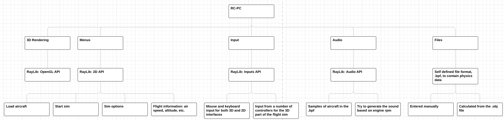
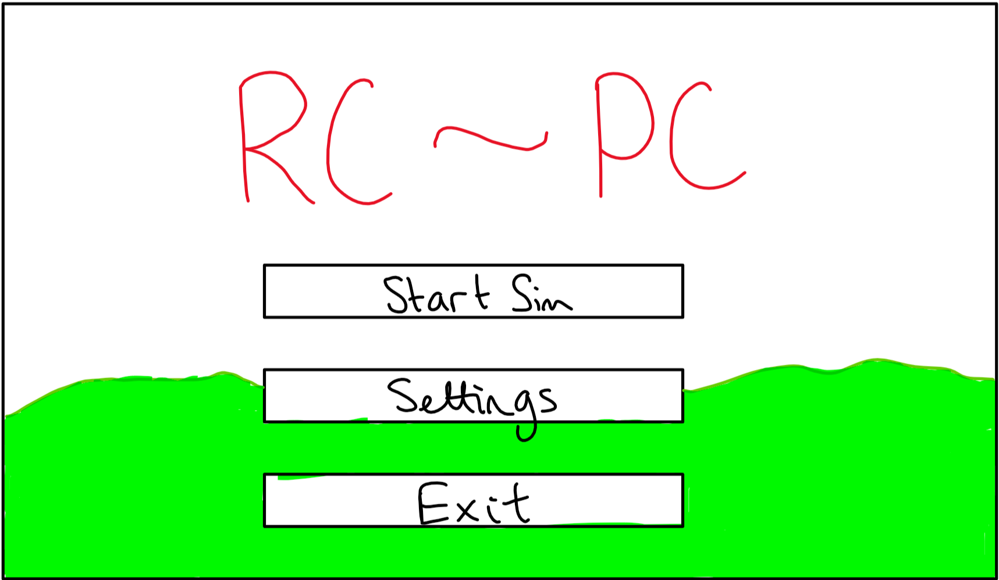
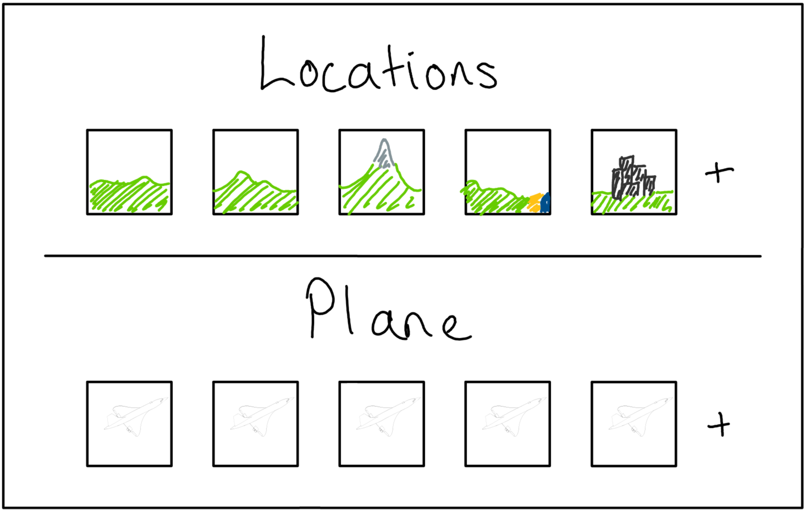
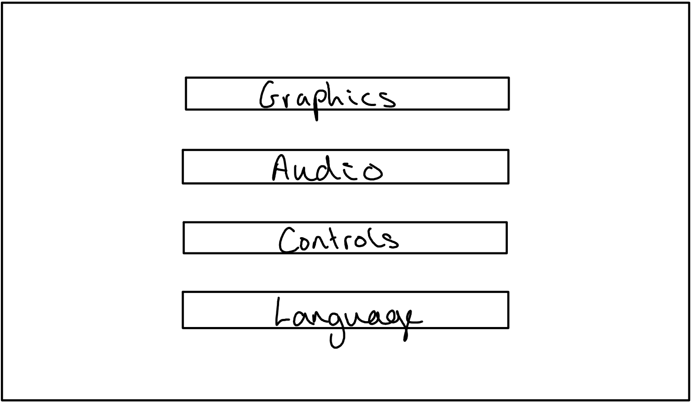
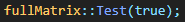
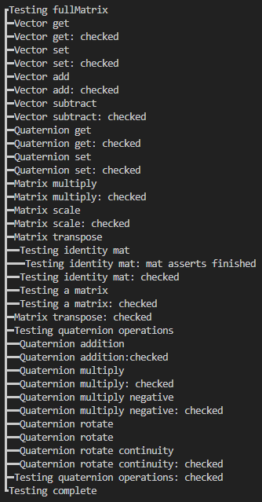

## Design
---


### Menus
---

#### Main Menu



- "Start Sim" button to open the location and plane select menu
- "Settings" button to open the settings menu
- "Exit" button to exit the application
- Use a render of the previous or default location as the background

#### Start Sim



- Show most commonly used in order
- Select a location and plane
- Add level from .obj
- Add plane from custom format
- Same background as main, possibly with blur or reduced alpha

#### Settings



By reducing and fully categorising all available options 

- Graphics
	- Texture quality
	- Model quality
- Audio
	- Audio device
	- Volume
- Controls
	- Input devices
	- Sensitivity
	- Channels
- Language?

#### 3D Simulator

- After selecting an aircraft and location, the simulator will be loaded
- This will be a rearrangement of the 3D scene used in the background of the menus
	- This will remove the need to either hide, or load, extra assets for the sim
	- This should help reduce load times into the sim once the application has been started

---
### Objects

#### Objects

|Variable|Datatype|Reason|
|:---|:---|:---|
|position|3D Vector|for object location in 3D space|
|velocity|3D Vector|to integrate to location in 3D space|
|acceleration|3D Vector|to integrate to velocuty; simplifies gravity|
|rotation|Quaternion|avoids gimble lock present in Euler implementations|
|angular velocity|3D Vector|to integrate to rotation|
|scale|3D Vector|for the x, y and z scale of each object|
|model|raylib::Model|the model data: textures, meshes, etc.|

- Functions
	- Initialiser
		- Take a string from which to load the object data into the model attribute
	- Draw
		- Use the attributes to draw the object to the world
	- Update
		- Use numerical integration on the movement attributes

#### Vectors and Matrices

Use a 2D array to allow dynamic sizes of vectors and matrices
Will need to consider how to invert / find the conjunction of square matrices; probably using an if statement and accounting for specific cases would be best

- Attributes
	- 1D element array
	- integer columns
	- integer rows
- Functions
	- Indexing
	- Basic arithmetic
	- Powers
	- Inverse
	- Normalise

#### Other

To make full use of the axis-angle rotation, quaternions will be required
This will allow full use of angular velocity and accelerations

While raylib already implements many of these, it may be beneficial to write my own vector and matrix lib to allow full use of all required overloads

---
### Algorithms

#### Vector and Matrix Maths Lib

- Simulating a 2D array using a 1D array

---

```
double[] array = new array[width * height]

double get(x, y):
	return array[x * width + y]

void set(x, y, val):
	array[x * width + y] = val
```

---

This will allow me to make use of a dynamic 2D array in C++ as there is no built in structures to allow this

---

```
matrix add(other):
	for i in range(columns):
		for j in range(rows):
			self(i, j) += other(i, j)

matrix sub(other):
	for i in range(columns):
		for j in range(rows):
			self(i, j) -= other(i, j)

matrix mult(other):
	for i in range(columns):
		for j in range(rows):
			sum = 0
			for k in range(columns):
				sum += self(k, j) * other(i, k)
			self(i, j) = sum
```

---

I will also need to be able to calculate a matrix inverse for rotating quaternions and normal vectors
Doing this will require:
- A function to produce the minor matrix from a matrix and element location within the matrix
- A function to produce the full minor matrix
- A recursive function to calculate the determinant of a matrix
- A function to calculate the cofactors
- A function to calculate the final inverse/transpose of the matrix

---

```
matrix minor(x, y):
	minor = matrix(this.m - 1, this.n - 1)
	a = 0
	b = 0
	a_inc = False

	for i in range(this.m):
		for j in range(this.n):
			if not (x == i or y == j):
				minor[a, b] = this[i, j]
				b += 1
				a_inc = True
		if a_inc:
			a += 1
			a_inc = False
			b = 0
	return minor

double det():
	if this.m == this.n:
		if this.m == 2:
			return this[0,0] * this[1,1] - this[0,1] * this[1,0]
		else:
			det = 0.0f
			for i in range(this.m):
				if i % 2 == 0:
					det += this[i, 0] * this.minor(i, 0).det()
				else:
					det -= this[i, 0] * this.minor(i, 0).det()
			return det

matrix matOfMinors():
	rtn = matrix(this.m, this.n)
	if this.m == this.n:
		for i in range(this.m):
			for j in range(this.n):
				rtn[i, j] = this.minor(i, j).det()
	return rtn

matrix cofactors():
	rtn = matrix(this.m, this.n)
	if this.m == this.n:
		minors = this.matOfMinors();
		for i in range(this.m):
			for j in range(this.n):
				if (i * this.n + j) % 2 == 1:
					rtn(i, j) = -minors[j, i]
				else:
					rtn[i, j] = minors[j, i]
	return rtn

matrix inverse():
	return this.cofactors() * (1/this.det())
	
```


---
### Input Validation

- Combinations of keys: e.g. Ctrl, Shift, Caps Lock, etc.

---
### Unit testing

- Testing specific functions with specific test cases
- Set up test functions to be run at program start while in debug mode to test the basic functions of classes and functions

##### Testing the matrix class
|Function to test|Given input|Expected output|
|:---|:---|:---|
|Vector get||
|Vector set||
|Vector add||
|Vector subtract||
|Quaternion get||
|Quaternion set||
|Quaternion add||
|Quaternion multiply||
|Quaternion multiply with a negative||
|Quaternion rotate||
|Quaternion rotate continuity||
|Matrix multiply||
|Matrix scale||
|Identity matrix inverse||
|Arbitrary matrix inverse||

This testing is run at startup of the program

This function outputs the debug results to the terminal if the boolean argument is set to true

This ensures that the class is functioning correctly before entering the main loop