## Developing a Coded Solution

---

### Setting up development environment

```#include "raylib.h"``` is required to make use of the raylib library

A standard C `int main(void){}` is defined as the program entry point

An OpenGL window can now be initialised using the raylib interface with

```InitWindow(screenWidth, screenHeight, "Window name");```

with screenWidth/Height as int's

```SetWindowState(FLAG_WINDOW_RESIZEABLE)``` for a resizable window

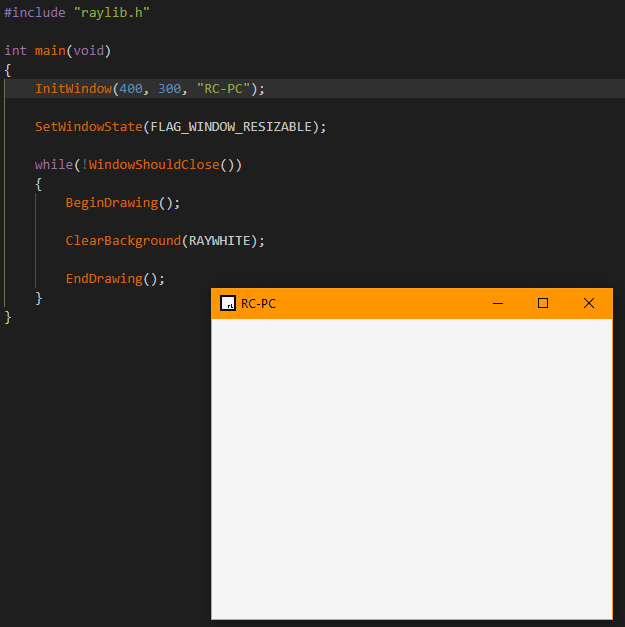

---

#### Setting up [VSCodium](https://vscodium.com/) to facilitate development

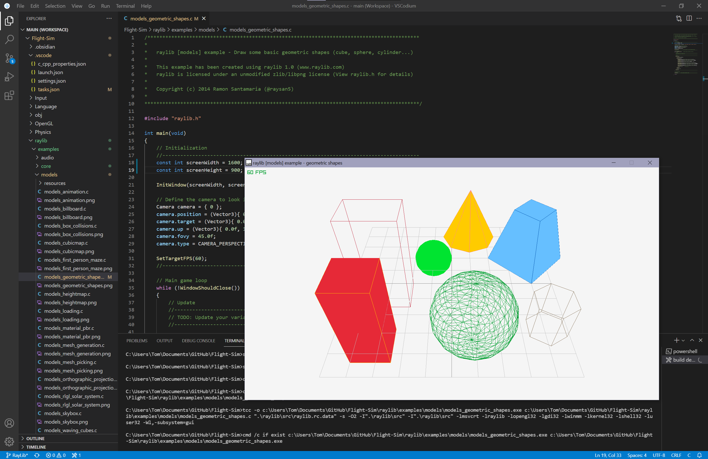

Added a shortcut to build and run the active file to allow for easier and quicker testing.

Above shows one of the RayLib examples I have used to test that the shortcut functions as expected.

---

#### First rendering
Due to my lack of previous experience with both OpenGL and C# for graphical rendering, I intend to first produce a simple application to learn how OpenGL can be used with imported .obj files and render them.

Once I have a better understanding of the architecture, I should be able to construct the application without the need for copying code directly.

I will be following an [OpenGL in C++](http://www.opengl-tutorial.org/beginners-tutorials/tutorial-1-opening-a-window/) tutorial to develop my first application in C++ and OpenGL. This covers the basics of C++ and OpenGL to be able render an object using shaders.

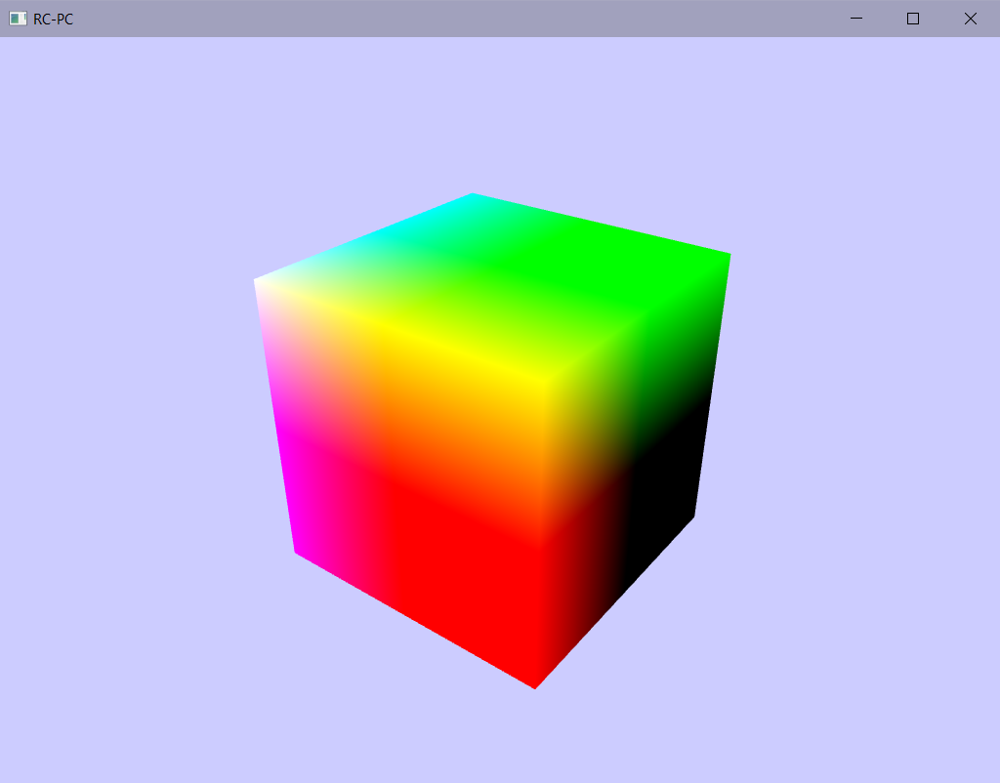

---

#### Loading from a .obj file

[Tutorial](https://ogldev.org/www/tutorial22/tutorial22.html)

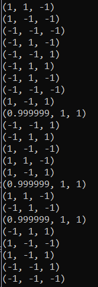

A .obj stores the points within the mesh of an object. These can be extracted form the file using Assimp and then loaded into the mesh array for the renderer.


---

### C++ rather than C

Using a port of raylib to c++ will provide access to the OOP features that will help to formalise the structure of the program

As I will still be using raylib and the change is only from C to C++, much of the code remains the same

---

#### Setting up C++

Starting with simply opening a window using C++ rather than C

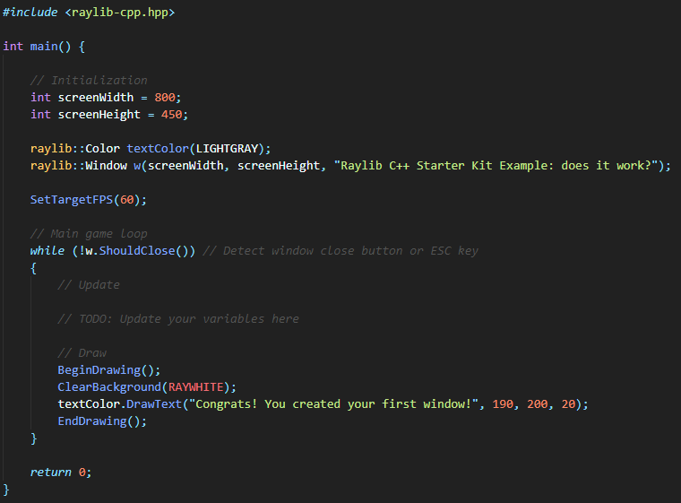

The above shows a demo I found which simply opens a windows and displays some text on it

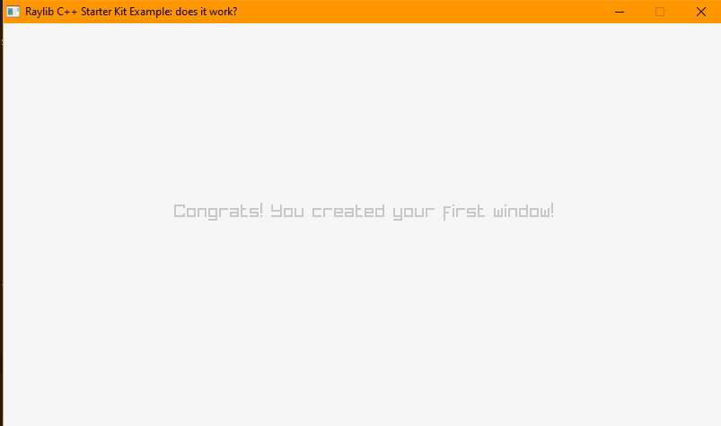

Allowing window resizing
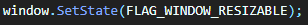

---

#### Setting up 3D rendering

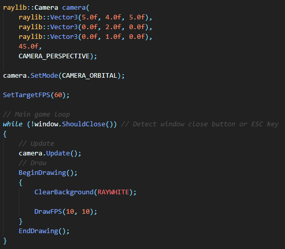

Not currently rendering anything
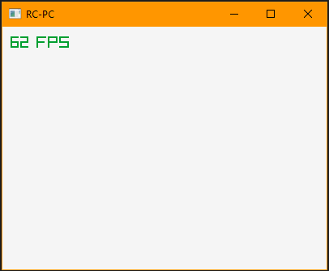

---

### Example shaders

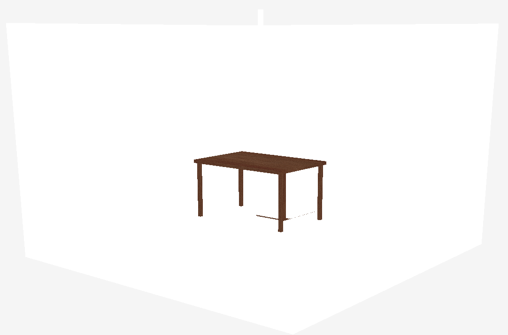

Testing one of the example shaders with an object made in Blender

---

### Shaders

[GLSL Tutorial](https://learnopengl.com/Getting-started/Shaders)
[OpenGL Shader documentation](https://www.khronos.org/opengl/wiki/OpenGL_Shading_Language)

#### Fragment Shaders

Fragment shaders handle the shading of material in between vertices by either interpolating the vertex colours, or using a UV map

This is where ambient, diffuse and specular lighting and reflections are calculated

#### Vertex Shaders

Vertex shaders handle the rendering of vertices and their location within a UV map

They take the location of each vertex within object space and convert this to world space using the camera position and orientation

They also handle light location and normals for standard shading

---

### Object loading

Raylib contains helper methods for parsing .obj files and allows the easy import of a .obj and its related material files

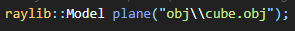

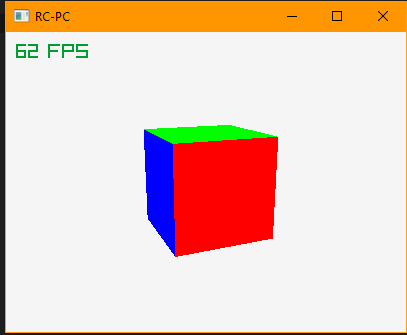

---

### Shaders

Shaders must then be set for each material to allow the renderer to know what to draw to the screen

The object can then be drawn during the loop
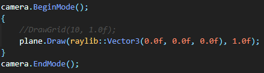
A grid can also be rendered to show y=0
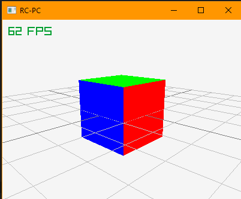
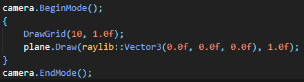

---

### Updating location during runtime

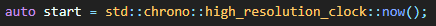
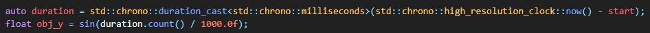
By re-coding the start time of the program, the total run time can be determined
This can then be used as a parameter of some function to determine location

---

### Object tracking


A more complex movement can be traced by changing all three x, y and z components of the object's location
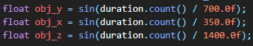
The object can then be tracked by pointing the camera at this location
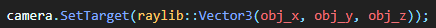

---

### Gravity


Gravity can then be implemented using a SUVAT and the total elapsed time
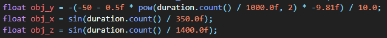

---

### Moving the model data to an object


Now making use of an object class and instancing to keep track of objects and render them
This will help keep the code clean, as it removes the need to hard code each object required

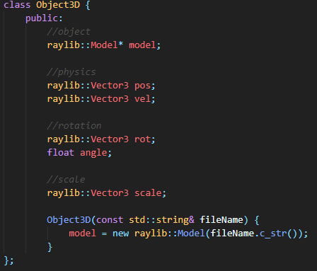

Object definition

|Variable name|Type|Usage|
|:---|:---|:---|
|model|raylib::model*|mesh and material data for the object|
|pos|raylib::Vector3|location of the object in 3D space|
|vel|raylib::Vector3|velocity of the object in 3D space|
|rot|raylib::Vector3|axis around which to rotate|
|angle|float|the angle to rotate around the above axis|
|scale|raylib::Vector3|scale factor of the model|

This initial design simply holds the data required for rendering the object

It would be better to implement a number of the required function which are currently within the main function into this class as any object that needs rendering would require them
Many of these attributes would also have standard values, which would be useful not to need to initialize for every object

---

### Numerical integration

Rather than using a predefined SUVAT for movement, integrating an acceleration for velocity and then integrating velocity for position allows the changing of both acceleration and velocity during runtime

This can be easily achieved by tracking the previous frame time and subtracting this from the current time to find the change in time between the two frames
This will make any physics based off this time entirely frame independent

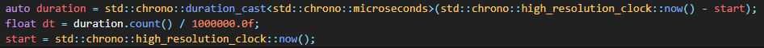

The first version of this missed setting start to the current time at the end of dt, resulting in dt being found as the total time since the program started


---

### Moving per object functions to the Object class

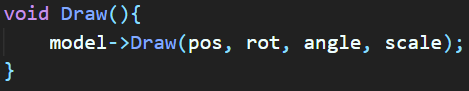

Moving the draw function to within the class allows the use of the local object variables without the need to first extract the required data for drawing from the object

This also allows for the code within the main loop to be kept simpler as each object only requires a single function call to draw

---

#### Per Object physics

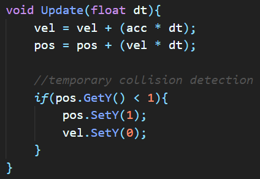

By moving the physics updating to a function, the code in the main loop can be further simplified to only require an update call and a draw call per object

This new implementation also features a collision detection with y=0 to allow the cube to stop falling at this plane


---

### Quaternions

---

To fully represent the required rotations for a plane in 3D, quaternions are required

A Quaternion is defined as a 4D vector

$$
\begin{pmatrix}
i \\
j \\
k \\
w \\
\end{pmatrix}
$$

Where i, j and k can be imagined as a 3D vector with w as a rotation around this 3D vector

Each of these can take a value between -1 and 1; that is, a quaternion is a 4D unit vector

As raylib  makes use of axis-angle, it is relatively simple to convert between quaternions and the format required by raylib

[source for below equations](https://www.euclideanspace.com/maths/geometry/rotations/conversions/quaternionToAngle/index.htm)

#### Quaternion to Axis-Angle

$$ \theta = 2 * \arccos(w) $$
$$ x = \frac{i}{\sqrt{1-w^2}} $$
$$ y = \frac{j}{\sqrt{1-w^2}} $$
$$ z = \frac{k}{\sqrt{1-w^2}} $$

#### Axis-Angle to Quaternion

$$ w = \cos{\frac{\theta}{2}} $$
$$ i = x\sin{\frac{\theta}{2}} $$
$$ j = y\sin{\frac{\theta}{2}} $$
$$ k = z\sin{\frac{\theta}{2}} $$

#### Multiplication

$$ w = w_1 w_2 - x_1 x_2 - y_1 y_2 - z_1 z_2 $$
$$ i = w_1 x_2 + x_1 w_2 + y_1 z_2 - z_1 y_2 $$
$$ j = w_1 y_2 - x_1 z_2 + y_1 w_2 + z_1 x_2 $$
$$ k = w_1 z_2 + x_1 y_2 - y_1 x_2 + z_1 w_2 $$

---

Raylib contains some helpers for working with quaternions, such as a quaternion to axis-angle conversion, but will require the implementing of some way to integrate a quaternion velocity and possible quaternion acceleration

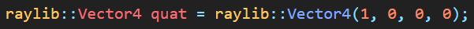
The above is the rotation quaternion within the object class

By modifying the draw function, the new quaternion representation of the rotation can be used


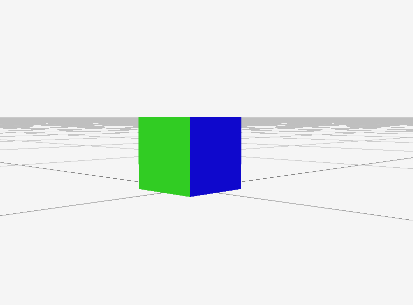


Now able to rotate an object using an Euler 3D vector for angular velocity

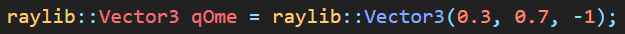

Along with an integrator from the update angular velocity to the rotation quaternion

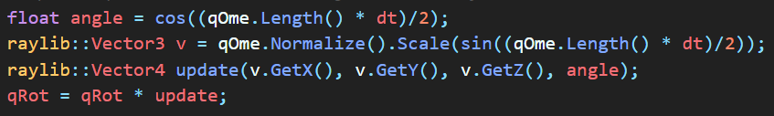

---

### Adding simple movement input


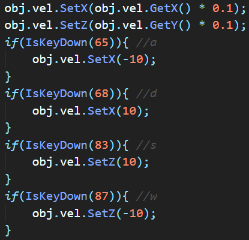

By damping the x-y velocity, an effect similar to friction can be achieved
The velocity is set to a particular amount in a particular direction when one of the "wasd" keys is pressed
As the velocity is already being integrated for position, the implantation of this user input is trivial

---

### First person

By moving the camera to the player object's location and rotation, first person gameplay is achieved
As both the object location and rotation are already available from the object, they can simply be set as the camera location and rotation

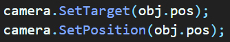

As the camera is set to the object's location, the target can no longer be the object itself
This will need to be a unit vector rotated by the quaternion to be in front of the camera


For debugging purposes, the camera target is set to another object's location with is placed at the origin

---

#### Rotating the velocity with the quaternion


By rotating the velocity be the quaternion, the look direction of the camera can be kept consistent with the direction of movement caused by the keyboard input

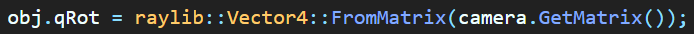

In this case, for debugging, the object quaternion is set using the camera's quaternion as this can be easily updated using the `SetTarget` function

---

### Making a matrix class

The matrix class begins with a simple double array and two integers to define the width and height of the matrix

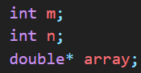

This will be the base data structure used to store all data about the matrix

A get and set function are required to translate an x,y position in the matrix into the required index in the double array

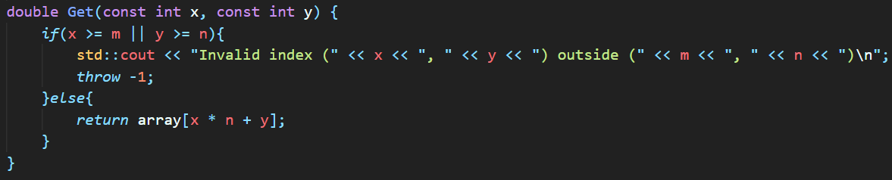

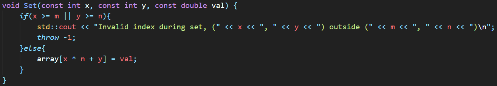

If the position is outside of the matrix, the function will throw an error after printing an out-of-bounds message

With these two functions, all matrix operations can be derived

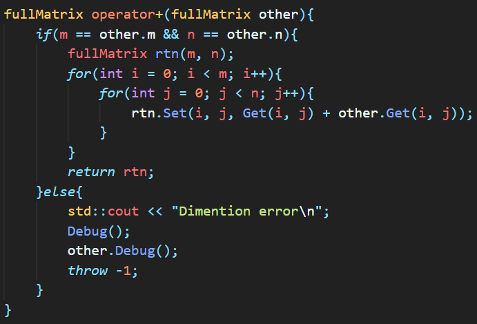

Until all functions shown in the algorithms section of Design are complete and tested

The raylib::Vector4 quaternion class currently in use appears to have some problems with my current aim which is to rotate the camera using the mouse for debugging rotation, movement and rendering

---

### Pointers

---

#### Working with the copy object constructor

```
fullMatrix(const fullMatrix& other){
   m = other.m;
   n = other.n;
   array = new double[m * n];
   memcpy(&array, &(other.array), m*n);
   std::cout << m << ", " << n << "\n";
 }
```

When an object is passed into a function or returned from a function, the object is redecleared through the copy constructor

This caused a number of problems before I rewrote this function to correctly copy the attributes of the object. As the array was not being copied correctly, the data was lost seemingly without reason.

Making correct use of array copying gives:

```
fullMatrix(const fullMatrix& other){
   m = other.m;
   n = other.n;
   array = new double[m * n];
}
```

As this avoids the need to understand how many bytes each of the elements is using, along with the number and values of the bytes used to keep track of the array size used during delete[] array.

After these changes, the matrix class can now be used for vector addition.

Further unit tests need to be written before the use of the rest of the functions to ensure they are working correctly before attempting to implement anything complicated.

The matrix class' delete function, ``~fullMatrix``, simply calls delete[] on the object's array. This is probably not necessary as this should be the default behaviour.

---

### Look vector camera movement

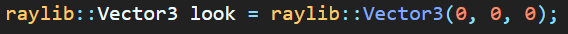

A look vector is defined in the object class and is updated in the update function

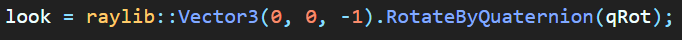

The camera can then target its position plus this look vector

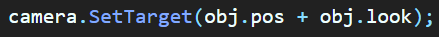

Bellow is a demo of this


The camera is rotated with a and d with forward and backward motion on w and s

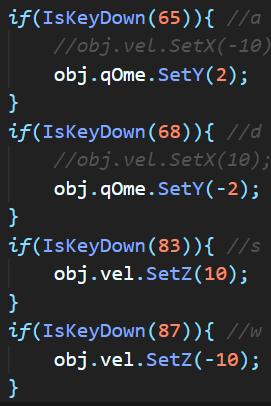

---

### Mouse input

First the mouse must be setup by hiding it

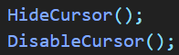

The change in mouse location is then calculated and a sensitivity factor is used
The mouse is then moved back to the center to allow the next mouse change to be calculated

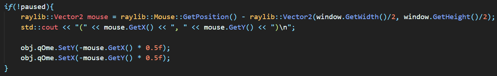

A pause button to allow moving the mouse away from the program 

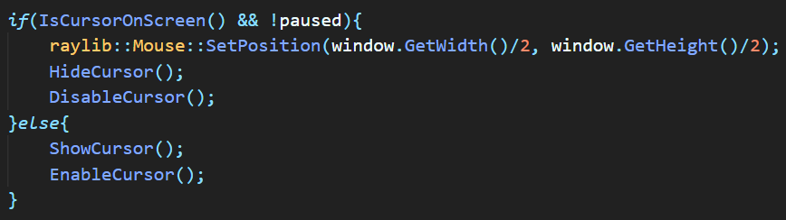

A pause toggle button is added to p

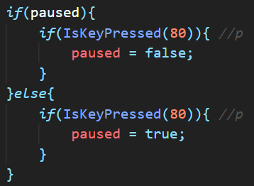

---

### Camera up vector

Currently, the object drifts as the velocity and acceleration are not being correctly rotated

Adding the camera up vector will allow easier debugging of this by displaying the problem

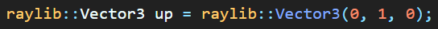

The up vector is defined within the object class

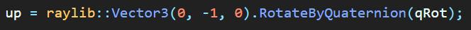

The up vector is updated within the update function

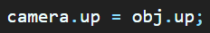

The camera up vector is then set to the object's up vector


---

### Splitting classes into files

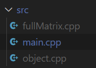

Splitting the classes into separate files will clean up the main file and make it easier to keep the code organized

---

### Replacing boolean game state with an enum

This will allow easier reading as well as easy addition of new game states, such as main menu or other specific menu area

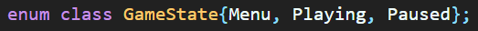

---

### Transferring physics to the matrix class

Most of the code remains the same beside the class names used at initialization

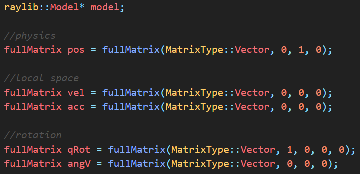

Now using an explicit definition of the update quaternion

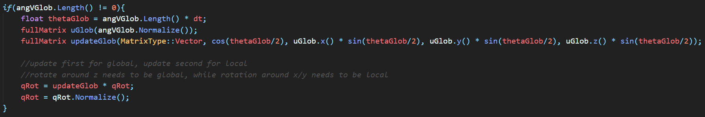

This also checks for a 0 length angular velocity which would result in a divide by zero error when normalizing if left

The formula for the update quaternion is from [this lecture from Stanford University](https://stanford.edu/class/ee267/lectures/lecture10.pdf)

---

### Correcting use of global and local space


Added new global versions of acceleration and velocity to remove the reliance on the rotation quaternion and to reduce the time complexity


Splitting of the angular velocity into global and local movements allows the rotation required for use with a mouse

This solution also ensures that any combination of global and local rotation transformations can be easily tested and achieved

When used with a controller, most of the inputs will need to be local and the control surfaces of an aircraft act on along the axis of the plane

---

### Shaders


By using the dot product of the normal of the surface and a direction from which to project light, the surface can be coloured with an effect similar to shadows within a single convex shape


Scaling a shade of green with the dot product of the vertex and an arbitrary direction for the light source

---

### Shaders finished


The shaders now simulate shadows relatively well with the runway correctly colourised


---

### Debugging an array deletion


The above debug log shows the use of the debug function in debugging an array deletion error in which an array used by an instance of the fullMatrix class is deleted more than once, resulting in an uncatchable crash

Problem found to be the result of using `rtn = rtn * dA` where `rtn` is the fullMatrix matrix containing the inverse matrix to be returned and `dA` is the inverse of the determinant of the matrix.
This version appeared to result in the deletion of one of the required arrays while the version used while testing the `fullMatrix * double` function performed as expected.
By changing over to using the version from the scale test, `fullMatrix rtn(cofacts * dA)`, the inverse matrix function now performs as expected.

---

### Overloading the assignment operator


Explicitly defining the assignment (=) operator appears to have fixed many of the issues that randomly appeared while trying to debug the random crashes from the matrix testing